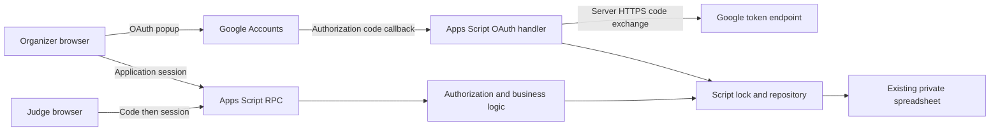

# Architecture and data integrity

## Deployment boundaries

The Apps Script web app executes as its owner, keeping the spreadsheet private. HTML Service serves one responsive client. Only `doGet` and the authenticated `rpc` gateway are browser-visible global functions. Pure application logic lives inside the `Hub` bundle. Private editor helpers end with `_`.

The Apps Script runtime does not reliably expose a visitor's Google email when executing as its owner. Organizer login therefore uses Google's OAuth authorization-code server flow, separate from Apps Script's own owner authorization. A popup carries public OAuth state; the main app retains a separate secret proof. Only that originating app session can collect the verified organizer identity. This avoids an extra permanent server while retaining Google Sheets and secure account verification.

## Modules

- `services/application.js`: explicit operation registry; authentication and role gate precede every protected handler. Input is allowlisted field-by-field. No arbitrary table-read/write endpoint exists.
- `auth/authorization.js`: session validation, role checks, active assignments and Google claim checks.
- `auth/google.js`: one-time OAuth state, nonce, PKCE, code exchange and origin-tab polling proof.
- `database/apps-script.js`: restricted sharing check, schema preflight, serialized transactions, Sheets batch reads/writes, restricted backup creation.
- `services/assignments.js`: pure minimum-cost flow planner and assignment validation.
- `services/results.js`: pure aggregation of current evaluation versions and category rankings.
- `scripts/mock-env.mjs`: isolated in-memory adapter using the same business rules; never included in the server deployment bundle.

## Worksheets and storage

The workbook has Projects, Judges, Assignments, Evaluations, Rankings, Categories, Results, Settings, AuditLogs, plus Meta, Sessions, AuthFlows and Awards. See `src/database/schema.js` for the complete ordered column schema.

Every record has a stable ID. Project/judge IDs are monotonic `H001`/`J001` sequences generated while locked; renames never alter IDs. Assignment/evaluation IDs are opaque random values. Spreadsheet row positions are internal persistence addresses, never authorization identities.

**Each data cell contains a typed JSON scalar or array/object serialized as a string.** For example a name is stored as `"Canopy"`, a boolean as `true`, and a criterion object as JSON. This preserves nulls, numbers and nested structures and avoids locale-dependent date/number conversion. The adapter writes explicit Sheets `stringValue`, preventing formula execution. Column headers are plain text. Organizers should use the website, CSV exports and backup procedures rather than manually editing these cells.

Initialization preflights all reserved worksheet headers and schema metadata before creating anything. Unknown versions stop initialization. Missing initial settings are inserted only if absent. There are no automatic destructive migrations.

## Transactions

A script-level lock spans read, schema validation, authentication, duplicate detection, business changes, and one Google Sheets `spreadsheets.batchUpdate` call. Dirty rows, correction history, audit entries, and result summaries are sent together. Google validates the batch and applies the requests atomically. Reads are also locked, so a browser cannot observe a partial application transaction. Pending SpreadsheetApp operations are flushed before the lock is released.

A 10-second lock timeout produces `RETRY` without a record write. Network uncertainty produces a generic safe-retry message. Evaluation request IDs and judge/assignment/version uniqueness prevent duplicate submissions on retries. Administrative operations with external Drive side effects are not cross-service transactions: a Drive backup may succeed even if the subsequent audit write fails. An organizer should check Drive before repeating such a request.

Rate counters and token-generation counters live in Script Properties, intentionally outside the database commit, so failed authentication still consumes its rate budget and failed requests cannot reuse PRF sequence values. Old expired sessions and OAuth flows are pruned; judging history is preserved.

## Assignments

Each project/category requires its configured number of independent judges. Overall assignments use the event target; specialist categories have their own target, rubric and explicitly permitted judges. A judge's capacity covers all category assignments.

The planner builds a flow network from category/project demands to eligible judges. Incrementally increasing judge-slot costs balance total load. Expertise matching is a lower-priority preference, never a reason to violate availability, conflicts, independence or capacity. Augmenting paths allow earlier choices to be revised when constrained projects need a particular judge.

Existing active assignments are retained. Unfinished assignments can be reassigned with a reason; the original is marked `reassigned`. If any evaluation history exists, it cannot be reassigned away. An organizer may add a supplemental independent judge and review the resulting coverage flag. Plan saves check the event revision and recalculate while locked.

## Results

Live results are calculated from source records at read time; a materialized Results worksheet is also refreshed in successful business write transactions. Reconcile rebuilds this derived worksheet. There are no manually maintained spreadsheet formulas.

Only the latest non-reopened evaluation per active assignment contributes. Previous scores remain in Evaluations, and the reopening audit includes their prior values and the reason. Late conflicts exclude the affected scores from calculation while preserving their records and flagging the affected project. Ranking changes and invalidations retain the previous selections in audit details. Reopening invalidates that judge's category ranking; a new ranking is required after corrections.

Rubric totals are averaged within each category. Ranking points are summed separately: 3/2/1. Provisional finalists are the first configured N projects ordered by category ranking points; everyone tied at the cutoff is included. Incomplete projects are labeled incomplete instead of automatically promoted, and may occupy the provisional cutoff until their data is resolved. There is no numerical combination of rubric and ranking points, or arbitrary tie-break winner.

Missing evaluations, unequal assignment coverage, missing rankings and ties are visible. The `available` short-ranking policy permits ranking all one/two eligible projects with 3/2 points. `requireThree` requires three completed eligible assignments. Panel decisions and reasons are stored separately. Confirmation requires prior finalist verification and a typed project ID; incomplete-data exceptions require explicit acknowledgment and a recorded reason.

## Scale

Designed for the stated event scale (50 projects, 10 judges, about 150 overall evaluations). Polling is 30 seconds and pauses in background tabs and while dialogs are open. Sheets reads are batched. The global lock prioritizes consistency over throughput; test with the actual organizer account and network before the event. Apps Script quotas and serialized access remain operational limits, not a promise of unlimited concurrent capacity.

References: [Apps Script web apps](https://developers.google.com/apps-script/guides/web), [Sheets batch updates](https://developers.google.com/workspace/sheets/api/guides/batchupdate), [Google OpenID Connect server flow](https://developers.google.com/identity/openid-connect/openid-connect#server-flow).
